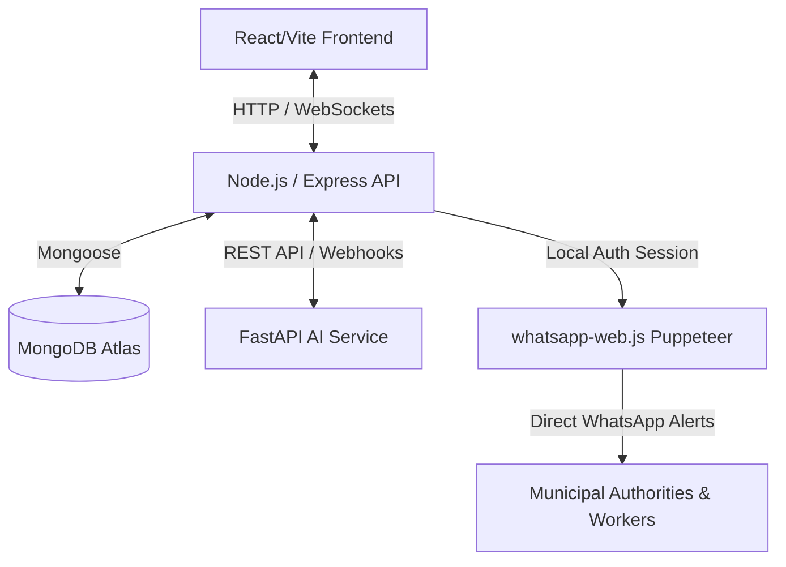

# 🚀 CleanCity AI: Deployment Guide

This guide provides step-by-step instructions to deploy the **CleanCity AI** system, which consists of:
1. 🗄️ **Database Layer:** MongoDB Atlas (Cloud Database)
2. 🤖 **AI Service:** FastAPI and YOLOv11/ONNX model environment
3. ⚙️ **Backend API:** Node.js/Express with WebSocket support and `whatsapp-web.js` (Puppeteer)
4. 💻 **Frontend Web App:** React & Vite UI dashboard

---

## 🏗️ System Architecture



---

## 📋 Table of Contents
1. [Phase 1: Database Setup (MongoDB Atlas)](#phase-1-database-setup-mongodb-atlas)
2. [Phase 2: AI Service Deployment (FastAPI)](#phase-2-ai-service-deployment-fastapi)
3. [Phase 3: Backend Deployment (Node.js & Puppeteer)](#phase-3-backend-deployment-nodejs--puppeteer)
4. [Phase 4: Frontend Deployment (React / Vite)](#phase-4-frontend-deployment-react--vite)
5. [💡 Production Best Practices & Troubleshooting](#-production-best-practices--troubleshooting)

---

## Phase 1: Database Setup (MongoDB Atlas)

The backend requires a MongoDB database. MongoDB Atlas provides a free-tier shared cluster.

1. **Create an Account:** Sign up at [mongodb.com/atlas](https://www.mongodb.com/cloud/atlas/register).
2. **Create a Database Cluster:** Choose the free **M0 Shared** cluster tier, select your preferred cloud provider (e.g., AWS), and pick the region closest to you.
3. **Database Access User:** Create a database user (e.g., username: `cleancity_user`, password: `a_strong_password`). Keep these credentials safe.
4. **Network Access (IP Whitelist):**
   - Go to **Network Access** under the Security tab.
   - Click **Add IP Address** and select **Allow Access from Anywhere** (`0.0.0.0/0`) since cloud servers have dynamic IP addresses.
5. **Retrieve Connection String:**
   - Go to **Database** under Deployment.
   - Click **Connect** on your cluster.
   - Select **Drivers** (Node.js).
   - Copy the connection string. It looks like:
     ```env
     mongodb+srv://cleancity_user:<password>@cluster0.xxxxxx.mongodb.net/?retryWrites=true&w=majority&appName=Cluster0
     ```
   - Replace `<password>` with your database user password. Save this as `MONGO_URI`.

---

## Phase 2: AI Service Deployment (FastAPI)

The AI Service runs a FastAPI environment executing a YOLOv11 custom model. By default, it loads the model weights from the local [ai_service/best.pt](file:///e:/BERLIN/ENGG/PROJECTS/Wmanthan/Illegal/ai_service/best.pt) file.

### 🎯 How to Use Your Own Custom `best.pt` Model
Follow these steps to deploy with your own custom-trained model:

1. **Replace the Model File:**
   - Copy your trained YOLO weights file (usually named `best.pt`) and overwrite the existing file at `ai_service/best.pt`.
2. **Verify File size & Git LFS (Large File Storage):**
   - If your model file is small (under 50MB, e.g. YOLOv11 Nano/Small), standard Git pushes will work perfectly.
   - If your model file is large (100MB+), standard Git pushes might fail or be blocked. Install and configure **Git LFS** before pushing:
     ```bash
     git lfs install
     git lfs track "ai_service/best.pt"
     git add .gitattributes
     ```
3. **Commit & Push to GitHub:**
   - Stage, commit, and push the updated model weights:
     ```bash
     git add ai_service/best.pt
     git commit -m "feat: updated custom YOLO model weights (best.pt)"
     git push origin main
     ```

---

### Option A: Hugging Face Spaces (Recommended for model hosting)
Since Hugging Face Spaces supports Docker Space setups, this is the easiest way to host the Python engine.
1. Create a Hugging Face account and click **New Space**.
2. Name your space (e.g., `illegal-dumping-env`), choose **Docker** as the SDK, and pick the **Blank** template.
3. Push your repository code (the root directory contains the `Dockerfile` configured to run FastAPI on port `7860`).
4. In the Space settings, add the following variables under **Repository Secrets**:
   - `ROBOFLOW_API_KEY`
   - `ROBOFLOW_MODEL_ID`
   - `BACKEND_URL` (Set this after completing the Backend Deployment step)

### Option B: Render or Railway
1. Create a new **Web Service** on Render/Railway pointing to your repository.
2. Set the **Root Directory** to `/` (root folder) so it picks up the root `Dockerfile`.
3. Add the environment variables listed above. Set the port environment variable `PORT` to `7860` or let the platform bind it.

---

## Phase 3: Backend Deployment (Node.js & Puppeteer)

> [!WARNING]
> The backend uses `whatsapp-web.js` which spins up a headless Chromium instance (via Puppeteer). Many cloud hosts (like standard Render/Railway Node.js buildpacks) fail because they lack the necessary system-level OS packages to run Chromium.

To solve this, a custom `Dockerfile` has been created in the `backend` folder which installs Chromium and all necessary Linux dependencies.

### Step-by-Step Deployment on Render / Railway:

1. Create a new **Web Service** on your cloud platform.
2. Select your repository, and set the **Root Directory** to `backend`.
3. Select **Docker** as the environment type (the platform will auto-detect `backend/Dockerfile`).
4. Set up a **Persistent Disk/Volume**:
   - **Why?** WhatsApp Auth stores session data in `.wwebjs_auth`. Without a persistent disk, every time the container redeploys or restarts, you will have to re-scan the QR code.
   - On Render/Railway, create a volume of `1GB` and mount it to `/app/.wwebjs_auth`.
5. Configure the following **Environment Variables**:
   - `PORT`: `5000`
   - `NODE_ENV`: `production`
   - `MONGO_URI`: *(Your connection string from MongoDB Atlas)*
   - `JWT_SECRET`: *(A long, secure random string for signing JWT tokens)*
   - `JWT_EXPIRE`: `7d`
   - `AI_SERVICE_URL`: *(URL of your deployed FastAPI AI Space/Server from Phase 2)*
   - `CLIENT_URL`: *(URL of your React frontend from Phase 4 - update this once frontend is deployed)*
   - `DETECTION_API_KEY`: *(Choose a custom secret token to secure webhook validation, e.g., `cleancity-detection-key`)*
   - `PUPPETEER_EXECUTABLE_PATH`: `/usr/bin/chromium` (Tells Puppeteer to use the Docker-installed Chromium)

### 📲 Authenticating WhatsApp:
1. Once the backend Docker container starts up, open the **deployment logs / terminal logs** in Render/Railway.
2. Look for the ASCII QR Code printout.
3. Open WhatsApp on your phone, go to **Linked Devices** > **Link a Device**, and scan the QR code from the terminal logs.
4. Once connected, your session will be saved to the mounted persistent volume.

---

## Phase 4: Frontend Deployment (React / Vite)

The frontend is a static React application built with Vite. It can be hosted on highly performant static providers like **Vercel**, **Netlify**, or **Cloudflare Pages** for free.

1. Register or log in to **Vercel** ([vercel.com](https://vercel.com)).
2. Click **Add New Project** and import your GitHub repository.
3. Set the configuration parameters:
   - **Framework Preset:** Vite
   - **Root Directory:** `frontend`
   - **Build Command:** `npm run build`
   - **Output Directory:** `dist`
4. Add the following **Environment Variables**:
   - `VITE_API_URL`: *(Your deployed Node.js backend URL, e.g., `https://cleancity-backend.onrender.com/api`)*
   - `VITE_SOCKET_URL`: *(Your deployed Node.js backend URL, e.g., `https://cleancity-backend.onrender.com`)*
5. Click **Deploy**.
6. Once deployed, copy your frontend production URL and update the `CLIENT_URL` environment variable in your **Backend Deployment**.

---

## 💡 Production Best Practices & Troubleshooting

### 1. WhatsApp Web Disconnections
If the container restarts and requires scanning the QR code again:
- Double-check that your volume mount in the platform settings is correctly configured to persist `/app/.wwebjs_auth`.
- If the logs show `Browser connection closed`, restart the backend service.

### 2. CORS Issues
If the frontend UI fails to load data:
- Ensure the Backend's `CLIENT_URL` matches the frontend's deployment URL *exactly* (without a trailing slash, e.g., `https://cleancity.vercel.app`).
- Clear browser cache and verify the backend environment variables loaded correctly.

### 3. Mixed Content / HTTPS
Vercel/Netlify enforce HTTPS. If your backend is deployed on an HTTP endpoint, the browser will block requests. Ensure your backend host provides an HTTPS URL (e.g., `https://...` instead of `http://...`).
